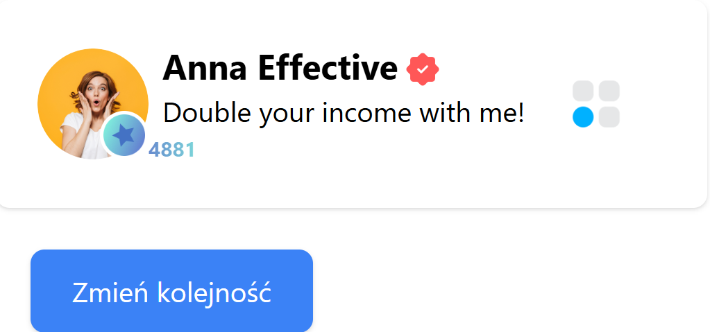

# React Application

## Description

This project is a React application developed to showcase a specific UI view. The task was to replicate the following design:

### Original Design
  

### Final Output


## Getting Started

To run the application locally, follow these steps:

1. **Clone the repository:**

   ```bash
   git clone https://github.com/yoinker57/recruitment-task-vsell.git
   ```

2. **Navigate into the directory:**

   ```bash
   cd recruitment-task-vsell
   ```

3. **Install the dependencies:**

   ```bash
   npm install
   ```

4. **Run the application:**

   ```
   npm start
   ```

5. **Open the application:**
   
      Open [http://localhost:3000](http://localhost:3000) to view it in the browser.


   